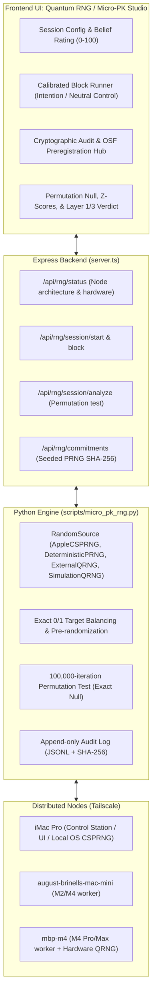

# Implementation Plan: Micro-PK Quantum RNG Experiment & Engine

**Date**: 2026-09-13  
**Project**: ANOMALISTIK (`finasteos/ANOMALISTIK`)  
**Host**: iMac Pro (Control Station) with remote Apple Silicon M4 / Tailscale worker awareness  

---

## Architecture & System Overview

The system is designed around the core principle: **radical openness in what we investigate, extreme conservatism in how we claim evidence**. It implements the blinded 4-arm design, strict target-balancing, pre-registered permutation testing, cryptographic audit logging, and distributed node awareness (Intel iMac Pro control station + remote Apple Silicon M4 nodes).

---

## 4-Arm Blinded Protocol Matrix

| Arm / Source | Condition | Visibility to Participant | Scientific Function |
| :--- | :--- | :--- | :--- |
| **Local Physical QRNG** | Explicit Intention (Target 0 / 1) | Blinded to source | **Primary Hypothesis** ($H_1$) |
| **Local Physical QRNG** | Neutral Attention Control (Hidden Target) | Blinded to source & target | **Primary Control** ($D_i$ baseline) |
| **Deterministic Seeded PRNG** | Explicit Intention | Blinded to source (feels identical) | **Negative / Placebo Control** (Pre-study commitment) |
| **macOS Kernel CSPRNG** | Explicit Intention / Control | Blinded to source | **Secondary Control** (System entropy baseline) |
| **Unattended Machine Baseline** | Machine Only (No human present) | N/A | **Instrument Systematics Check** |

---

## Key Design Principles

1. **No Real-Time Efficacy Peeking During Confirmatory Runs**: Participants and researchers will not see a live "win/loss" or rolling Z-score during active collection blocks. Feedback introduces stopping bias, operant conditioning, and researcher degrees of freedom. Subtle focusing cues and breathing pacers are provided instead.
2. **Hardware Fallback & Readiness**: If no physical USB QRNG (e.g. Crypta Labs Firefly/Cicada or Quantis) is physically connected, the module automatically labels runs as `ENGINEERING_PILOT` or `SECONDARY_CONTROL` using the macOS Kernel CSPRNG (`/dev/random`) and seeded PRNG. This allows full testing and dry-runs on the Intel iMac Pro without invalidating confirmatory data.
3. **Exact Target-Balancing**: Every session counterbalances Target 1 and Target 0 equally across both intention and control blocks, which mathematically neutralizes stationary hardware bias: $E[Z]_{\text{bias}} \approx 0$.
4. **Append-Only Cryptographic Audit Trail**: Each block produces raw bit hashes (SHA-256), monotonically recorded timestamps, machine hardware identifiers, and session configurations that cannot be rewritten.

---

## Proposed Changes

### 1. Backend & Data Engine
- **`scripts/micro_pk_rng.py`**:
  - Python engine with `RandomSource` abstraction (`AppleCSPRNG`, `DeterministicPRNG`, `ExternalQRNG`, `SimulationQRNG`).
  - Permutation null distribution calculator (100,000 iterations).
  - Target score $Z_j$ and subject difference $D_i$.
  - Append-only JSONL logging in `data/rng_sessions/`.
- **`server.ts`**:
  - Add Express routes: `/api/rng/status`, `/api/rng/session/start`, `/api/rng/session/block`, `/api/rng/session/analyze`, `/api/rng/sessions`.

### 2. Frontend UI
- **`src/components/QuantumRngSection.tsx`**:
  - Full-featured studio with Mindset Slider (0-100), Calibrated Target Guide, Blind Focus Ring, Recharts Permutation Histogram, Z-score differential metrics, and Layer 1/3 Verdict badges.
- **`src/components/Sidebar.tsx`**:
  - Add "Quantum RNG (Micro-PK)" navigation tab.
- **`src/App.tsx`**:
  - Mount new view.
- **`src/data/labData.ts`**:
  - Register Mission Q01 in the ANOMALISTIK research catalog.

---

## Verification Plan
1. Test CLI with `.venv/bin/python scripts/micro_pk_rng.py --test`.
2. TypeScript check with `npm run lint` (`tsc --noEmit`).
3. Production build test with `npm run build`.
4. Manual dry-run of a pilot session in the browser.
